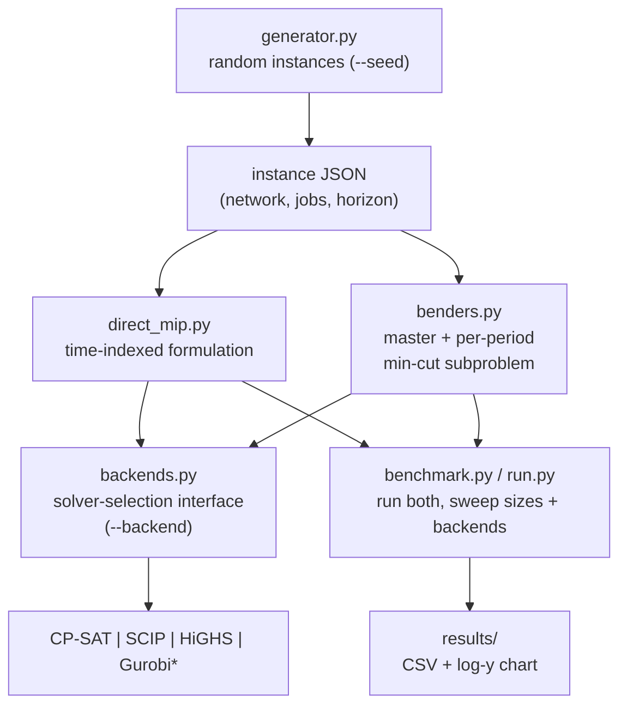
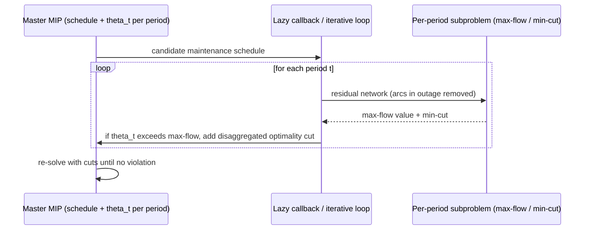

# Architecture

**network_flow_solver** — design intent. (No code yet; this documents the planned shape
from `claudecode-prompt-maintenance-scheduling.md`. Keep it in sync as code lands.)

---

## System Overview

A batch pipeline, not a service. An **instance generator** emits maintenance-scheduling
instances as JSON. Two solvers consume an instance and return the same metrics: a **direct
time-indexed MIP** (the baseline) and a **disaggregated Benders decomposition**. Both reach
the solver through one **thin backend interface**, so the same formulation runs on CP-SAT,
SCIP, HiGHS, or (if licensed) Gurobi. A **benchmark harness** sweeps instance sizes and
backends and produces the demo centrepiece — a log-y "solve time vs instance size" chart
showing Benders overtaking the direct MIP.

---

## Component Map

`*` Gurobi only if licensed — never a hard dependency.

---

## The backend interface (`backends.py`)

One thin seam isolates every solver-specific detail; the formulation files stay
backend-agnostic. Two families sit behind it:

- **CP-SAT** (`ortools.sat.python.cp_model`) — primary. Integer/Boolean only, so per-period
  flow vars are **integer**. Exact here: integral arc capacities ⇒ max flow has an integral
  optimum (commented in code). Idiomatic build with `CpModel` / `CpSolver`.
- **MathOpt** (`ortools.math_opt.python`) — fronts **SCIP**, **HiGHS**, and **Gurobi** via
  `SolverType`; flow vars are **continuous**. Preferred over the legacy `pywraplp` layer.

`run.py --solver-check` reports which backends are actually available at runtime (CP-SAT +
bundled SCIP/HiGHS always; Gurobi only if licensed) and fails clearly on a missing request.

---

## The two formulations

### Direct MIP (`direct_mip.py`)

Time-indexed formulation, built once and dispatched to a backend:

- Binary schedule vars (`x[j, start]` or in-progress `x[j, t]`).
- Flow vars per arc per period (integer on CP-SAT, continuous on MathOpt backends).
- Constraints: flow conservation, capacity tied to outage state (arc capacity → 0 while its
  job is in progress), each job scheduled exactly once / contiguously / within its window,
  optional ≤ `K` jobs in progress per period (CP-SAT intervals + `add_no_overlap`/cumulative
  are a natural fit; a plain time-indexed binary form is also fine — pick one, comment why).
- **Objective**: maximise total s→t flow summed over all periods.
- Returns: objective, gap, wall time, node/branch count where the backend exposes it.

### Disaggregated Benders (`benders.py`)

- **Master**: binary maintenance schedule + one continuous `theta_t` per period bounding
  that period's flow.
- **Subproblem per period**: given the schedule, max flow on the residual network. Solved
  as a **max-flow / min-cut** (`networkx.maximum_flow` or push-relabel) rather than an LP —
  faster, and a deliberate demo talking point.
- **Cuts**: one **disaggregated** optimality cut per period (not one aggregate cut), derived
  from the min-cut.
- **Cut injection — backend-dependent:**
  - *Lazy* via callback where the backend supports it (Gurobi natively; check whether
    MathOpt exposes lazy-constraint callbacks for SCIP).
  - *Iterative cut loop* otherwise (and always on CP-SAT): re-solve the master, add the
    disaggregated cuts as ordinary constraints, repeat to convergence.
  - Gated on `--backend`, assumption stated in a comment.
- LP-relaxation valid inequalities: optional flag-gated warm-start (stubbable with a TODO).
- Returns: same metrics as the MIP, plus cut count and iteration count.

---

## Backend comparison (Stage 5, optional)

The interface already abstracts the backend; Stage 5 just exercises it as a comparison
matrix — tabulate master and subproblem/evaluation solves across **CP-SAT, SCIP, HiGHS**
(and Gurobi if licensed) on a fixed instance set. Evidences the "split-solver: open MIP
backend for the master, free/fast LP for the evaluation flood" point and shows the demo is
not tied to any single licensed solver.

---

## Key design decisions

| Decision | Choice | Why |
|---|---|---|
| Solver layer | OR-Tools behind one `--backend` interface | Backend-agnostic formulation; no lock-in to a licensed solver |
| Primary backend | CP-SAT | Always available; strong on this integer-scheduling structure |
| Other backends | SCIP / HiGHS via MathOpt; Gurobi optional | Open solvers bundled; Gurobi only if licensed |
| Subproblem solver | max-flow / min-cut, not LP | Faster than an LP solve; the headline insight |
| Cut granularity | Disaggregated (one cut per period) | Tighter master, fewer iterations than one aggregate cut |
| Cut injection | Lazy callback where supported, else iterative loop | CP-SAT/some backends lack lazy callbacks; keep both paths |
| Outage model | Full outage (capacity → 0) | Start simple; partial-capacity model deferred |

---

## Open questions / known limitations

- Full-outage assumption only (no partial-capacity maintenance) for the first cut.
- Whether MathOpt exposes lazy-constraint callbacks for SCIP — determines lazy vs iterative
  for non-Gurobi MIP backends.
- Warm-start valid inequalities may ship as a stub.
