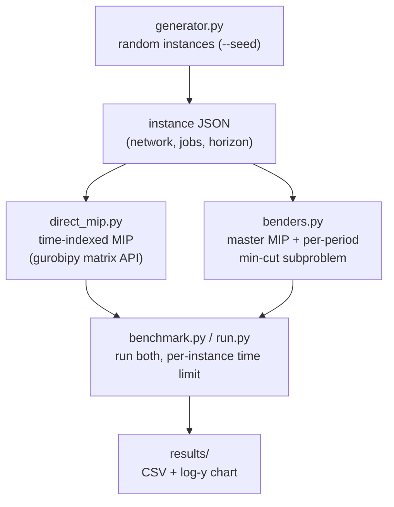
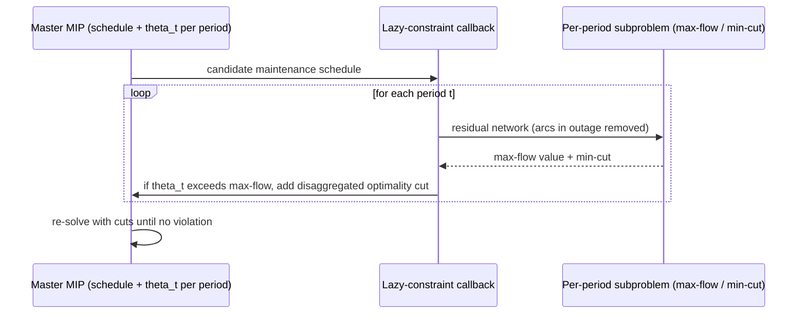

# Architecture

**network_flow_solver** — design intent. (No code yet; this documents the planned shape
from `claudecode-prompt-maintenance-scheduling.md`. Keep it in sync as code lands.)

---

## System Overview

A batch pipeline, not a service. An **instance generator** emits maintenance-scheduling
instances as JSON. Two solvers consume an instance and return the same metrics: a **direct
time-indexed MIP** (the baseline) and a **disaggregated Benders decomposition**. A
**benchmark harness** runs both across instance sizes and produces the demo centrepiece — a
log-y "solve time vs instance size" chart showing Benders overtaking the direct MIP.

---

## Component Map

---

## The two formulations

### Direct MIP (`direct_mip.py`)

Time-indexed formulation built with the **gurobipy matrix API** (`addMVar`, `@`):

- Binary schedule vars (`x[j, start]` or in-progress `x[j, t]`).
- Continuous flow vars per arc per period.
- Constraints: flow conservation, capacity tied to outage state (arc capacity → 0 while its
  job is in progress), each job scheduled exactly once / contiguously / within its window,
  optional ≤ `K` jobs in progress per period.
- **Objective**: maximise total s→t flow summed over all periods.
- Returns: objective, MIP gap, wall time, node count.

### Disaggregated Benders (`benders.py`)

- **Master**: binary maintenance schedule + one continuous `theta_t` per period bounding
  that period's flow.
- **Subproblem per period**: given the schedule, max flow on the residual network. Solved
  as a **max-flow / min-cut** (`networkx.maximum_flow` or push-relabel) rather than an LP —
  faster, and a deliberate demo talking point.
- **Cuts**: one **disaggregated** optimality cut per period (not one aggregate cut),
  derived from the min-cut, injected as **lazy constraints via a Gurobi callback**.
- LP-relaxation valid inequalities: optional flag-gated warm-start (stubbable with a TODO).
- Returns: same metrics as the MIP, plus cut count and iteration count.

---

## Solver boundary (Stage 5, optional)

The subproblem/relaxation solver sits behind a thin interface so the LP/flow evaluation
layer can run on **HiGHS (`highspy`)** instead of Gurobi — evidencing a split-solver
architecture: Gurobi for the master MIP, a free/GPU LP for the evaluation flood.

---

## Key design decisions

| Decision | Choice | Why |
|---|---|---|
| Subproblem solver | max-flow / min-cut, not LP | Faster than an LP solve; the headline insight |
| Cut granularity | Disaggregated (one cut per period) | Tighter master, fewer iterations than one aggregate cut |
| Cut injection | Lazy constraints via Gurobi callback | Avoids re-solving the master from scratch each round |
| MIP construction | gurobipy matrix API (`addMVar`, `@`) | Concise, vectorised, readable formulation |
| Outage model | Full outage (capacity → 0) | Start simple; richer partial-capacity model deferred |

---

## Open questions / known limitations

- Full-outage assumption only (no partial-capacity maintenance) for the first cut.
- Warm-start valid inequalities may ship as a stub.
- Gurobi license required for both solvers (and the master in Stage 5).
