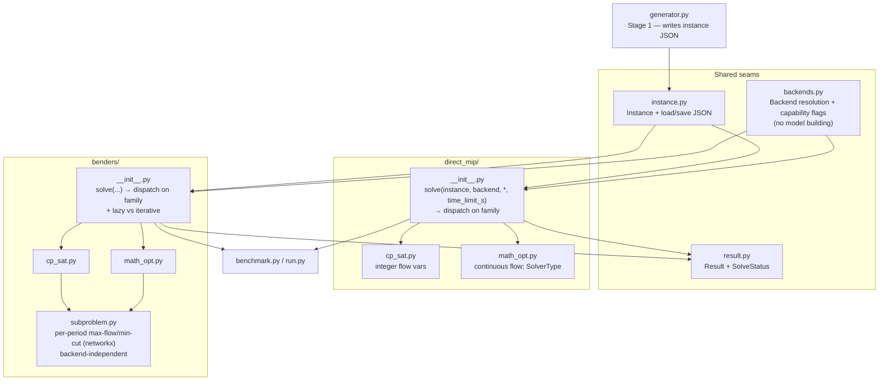
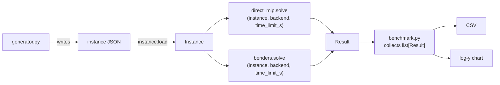

# Pipeline Data Model & Interfaces — Design

**Date:** 2026-06-27
**Scope:** The cross-cutting spine shared by every build stage — the instance data model,
the backend-selection interface, and the result record — plus the module layout and the
uniform `solve(...)` signature that ties them together. This is *not* a per-stage plan; it
fixes the seams so Stages 1–5 (`generator`, `direct_mip`, `benders`, `benchmark`) can be
built against stable contracts.

Companion to `docs/ARCHITECTURE.md` (which covers components and the two formulations). This
doc pins down the three things ARCHITECTURE.md left implicit: the **instance JSON schema**,
the **backend interface contract**, and the **result record**.

---

## Decisions at a glance

| Seam | Decision | Why |
|---|---|---|
| Backend modeling | **Per-API-family implementations** (one CP-SAT impl, one MathOpt impl per formulation) | CP-SAT and MathOpt are genuinely different APIs (integer vs continuous); two idiomatic impls beat one leaky facade. The three MathOpt backends (SCIP/HiGHS/Gurobi) share one impl, differing only by `SolverType`. |
| File layout | **Submodule per formulation** (`direct_mip/`, `benders/`) | Keeps each API-family impl self-contained and readable; dispatch lives in the package `__init__`. |
| Result record | **Rich superset, optionals `None`** | One frozen dataclass everywhere; method/backend fills what it has. Benchmark flattens to CSV; tests compare a subset. |
| Arc identity | **`(u, v)` tuple** | Simple JSON, maps to a plain `nx.DiGraph`. Forbids parallel arcs — generator must guarantee this. |

### Spec-wording note

CLAUDE.md says *"switching backend must never require touching the formulation"* and lists
single files `direct_mip.py` / `benders.py`. The per-API-family decision reads this as
**per-API-family, not per-backend**: switching *among* SCIP/HiGHS/Gurobi touches nothing
(same MathOpt impl, different `SolverType`). Only the CP-SAT↔MathOpt split is two code
paths, and that split is fundamental (integer vs continuous flow). The intended single files
become packages accordingly. This is a deliberate, flagged reading — more honest than a
facade that papers over the integer/continuous difference.

---

## Module layout



`benders/subproblem.py` is shared by both API-family impls — the per-period max-flow/min-cut
is pure networkx and the disaggregated optimality cut is derived **analytically** from the
min-cut (no solver call). A future variant with a different cut source is an additive file,
not a change to this seam.

---

## 1. Instance data model (`instance.py`)

JSON written by the generator and read by both solvers. Arc identity is the `(u, v)` tuple.

```json
{
  "name": "toy",
  "seed": 42,
  "horizon": 10,
  "source": "s",
  "sink": "t",
  "max_jobs_per_period": null,
  "nodes": ["s", "a", "b", "t"],
  "arcs": [
    {"u": "s", "v": "a", "capacity": 3},
    {"u": "a", "v": "t", "capacity": 2}
  ],
  "jobs": [
    {"id": "j0", "arc": ["a", "t"], "duration": 2, "release": 1, "deadline": 5}
  ],
  "known_optimum": 17
}
```

In-memory: a `frozen` `Instance` dataclass mirroring the JSON, with:

- `load(path) -> Instance`, `Instance.save(path)`
- `to_digraph() -> nx.DiGraph` — plain `DiGraph` (parallel arcs forbidden by tuple identity)

### Resolved assumptions (each becomes an inline comment in code)

1. **`deadline` is the latest *start* time**, not completion (spec: window of "allowed
   *start* times"). A job occupies periods `[start, start + duration - 1]`, with
   `release ≤ start ≤ deadline`.
2. **No parallel arcs** — consequence of `(u, v)` identity; asserted on load.
3. **`known_optimum` is toy-only.** Populated for small, hand-checkable instances
   (≤ ~10×10) and omitted otherwise. Above toy scale, correctness is *mutual agreement*
   (see Testing), not a stored number.

---

## 2. Backend interface (`backends.py`)

Resolves a `--backend` name to its API family and capability flags. **Builds no models** —
the formulation submodules read these flags to choose integer-vs-continuous and
lazy-vs-iterative.

```python
class ApiFamily(Enum):
    CP_SAT = "cp_sat"
    MATH_OPT = "math_opt"

@dataclass(frozen=True)
class Backend:
    name: str                      # "cp-sat" | "scip" | "highs" | "gurobi"
    family: ApiFamily
    solver_type: SolverType | None # MathOpt SolverType; None for CP-SAT
    continuous_flow: bool          # False for cp-sat (integer), True for mathopt
    supports_lazy: bool            # drives Benders cut-injection path

def resolve(name: str) -> Backend            # raises clearly on unknown/unavailable
def available_backends() -> list[Backend]    # powers run.py --solver-check
```

**KISS/YAGNI — exactly two capability flags.** `continuous_flow` and `supports_lazy` earn
their place because formulation code branches on them. Nothing else gets a flag: when a
backend doesn't expose, e.g., a node count, the impl simply sets `Result.node_count = None`.

- **`supports_lazy`** cannot be filled from first principles — it depends on whether MathOpt
  exposes lazy-constraint callbacks for SCIP at runtime (an open question in
  ARCHITECTURE.md). Default conservatively: CP-SAT → always `False`; SCIP → `False` until
  verified with the `inspect-package` skill when Stage 3 is built.
- **`available_backends()`** reports runtime reality: CP-SAT + bundled SCIP/HiGHS always
  present; Gurobi only if a license resolves. Never hardcoded.

---

## 3. Result record (`result.py`)

```python
class SolveStatus(Enum):
    OPTIMAL = "optimal"
    FEASIBLE = "feasible"       # stopped with an incumbent, not proven optimal
    INFEASIBLE = "infeasible"
    UNKNOWN = "unknown"         # no incumbent (incl. time limit with nothing found)

@dataclass(frozen=True)
class Result:
    method: str                              # "direct_mip" | "benders"
    backend: str                             # "cp-sat" | "scip" | ...
    status: SolveStatus
    objective: float | None                  # None if no incumbent
    wall_time_s: float
    gap: float | None = None
    schedule: dict[str, int] | None = None   # job id -> start period
    node_count: int | None = None
    iteration_count: int | None = None       # Benders only
    cut_count: int | None = None             # Benders only
```

- Each impl **normalizes its native status** into `SolveStatus` (CP-SAT's
  `OPTIMAL/FEASIBLE/INFEASIBLE/UNKNOWN`; MathOpt's `TerminationReason`). Tests and benchmark
  never see backend-specific codes.
- `TIME_LIMIT` is deliberately **not** a status: the time *limit* is a solve input
  (`time_limit_s`); the status only reports what came back (incumbent → `FEASIBLE`, nothing
  → `UNKNOWN`).
- **Benchmark** flattens `list[Result]` to CSV columns (missing optionals → empty cells).
- **Tests** compare the `(objective, status, schedule)` triple across method × backend;
  Benders-only fields are ignored in agreement checks.

---

## 4. Data flow & the uniform signature



Both formulation packages expose exactly one entry point:

```python
def solve(instance: Instance, backend: Backend, *, time_limit_s: float) -> Result
```

`benchmark.py` loops over `(instance, method, backend)` triples calling this, never touching
backend or formulation internals. `run.py` wires `--backend` (→ `backends.resolve`),
`--solver-check` (→ `available_backends`), and `--quick` (a small sweep).

The spine is the three shared modules — **`instance.py`, `backends.py`, `result.py`** — plus
this uniform signature. Everything else depends only on those.

---

## Testing implications

- **Toy instance:** known-answer test against `known_optimum`.
- **Above toy scale:** correctness is mutual agreement — direct MIP and Benders, and
  different backends, must agree on any instance both solve to optimality.
  - **Agree on `objective` and `status` strictly.** Do **not** assert `schedule` equality:
    maintenance instances routinely have multiple optimal schedules with identical objective,
    so CP-SAT / SCIP / HiGHS will legitimately return *different* `schedule` dicts at the same
    optimum. A strict `schedule ==` cross-check would flake. Instead validate each returned
    schedule independently — feasible and achieving the agreed objective — rather than
    identical across methods/backends. (Stage 2/3 test authors: bake this in from the start.)
- Status normalization is itself worth a small unit test per backend (native code →
  `SolveStatus`).

## Out of scope (deferred, flagged here)

- Partial-capacity outages (full outage only for the first cut).
- LP-relaxation warm-start valid inequalities (may ship as a stub).
- Confirming MathOpt's lazy-callback surface for SCIP — resolved when Stage 3 lands.
